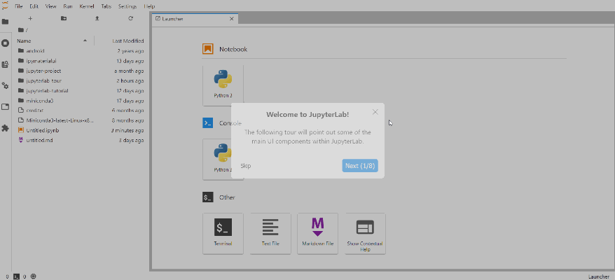

# jupyterlab-tour

[](https://mybinder.org/v2/gh/fcollonval/jupyterlab-tour/master?urlpath=lab)



A JupyterLab UI Tour based on [jupyterlab-tutorial](https://github.com/CDAT/jupyterlab-tutorial) and [react-joyride](https://docs.react-joyride.com).

Compare to `jupyterlab-tutorial`, this extension add the following features:

- Add default tours:
  - Welcome tour
  - Notebook tour
- If a tour has already be seen by the user, this is saved in the state database. So you can start tour on event only if the user have not seen it; e.g. the welcome tour is launched at JupyterLab start except if the user have seen it.

> The state is cleaned if this extension is updated

- Tooltip are styled using JupyterLab theming system
- Clear separation between tour manager and React views

And it keeps the nice features:

- Through the tour manager (`ITutorialManager` extension token), you can add, modify or delete a tour
- You can connect to tour events through signals
- You can override the default style for the tour separately.

## Requirements

* JupyterLab >= 2.0

## Install

```bash
jupyter labextension install jupyterlab-tour
```

## Contributing

### Install

The `jlpm` command is JupyterLab's pinned version of
[yarn](https://yarnpkg.com/) that is installed with JupyterLab. You may use
`yarn` or `npm` in lieu of `jlpm` below.

```bash
# Clone the repo to your local environment
# Move to jupyterlab-tour directory

# Install dependencies
jlpm
# Build Typescript source
jlpm build
# Link your development version of the extension with JupyterLab
jupyter labextension install .
# Rebuild Typescript source after making changes
jlpm build
# Rebuild JupyterLab after making any changes
jupyter lab build
```

You can watch the source directory and run JupyterLab in watch mode to watch for changes in the extension's source and automatically rebuild the extension and application.

```bash
# Watch the source directory in another terminal tab
jlpm watch
# Run jupyterlab in watch mode in one terminal tab
jupyter lab --watch
```

Now every change will be built locally and bundled into JupyterLab. Be sure to refresh your browser page after saving file changes to reload the extension (note: you'll need to wait for webpack to finish, which can take 10s+ at times).

### Uninstall

```bash
jupyter labextension uninstall jupyterlab-tour
```
